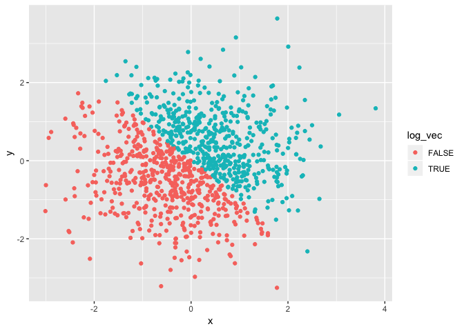

Homework 1
================

Sept 21, 2018

Francois Ban

### Problem 1

Below is a dataframe containing four different vectors:

A random sample of size 10 from a uniform\[0, 5\] distribution A logical vector indicating whether elements of the sample are greater than 2 A (length-10) character vector A (length-10) factor vector

``` r
prob1_df = tibble(
  rand_samp = runif(10, min = 0, max = 5),
  log_vec = rand_samp > 2,
  char_vec = LETTERS[1:10],
  fac_vec = factor(LETTERS[1:10])
)
```

Below is the mean of each variable in the dataframe (prob1\_df).

``` r
mean(prob1_df$rand_samp)
```

    ## [1] 2.757569

``` r
mean(prob1_df$log_vec)
```

    ## [1] 0.6

``` r
mean(prob1_df$char_vec)
```

    ## Warning in mean.default(prob1_df$char_vec): argument is not numeric or
    ## logical: returning NA

    ## [1] NA

``` r
mean(prob1_df$fac_vec)
```

    ## Warning in mean.default(prob1_df$fac_vec): argument is not numeric or
    ## logical: returning NA

    ## [1] NA

After taking the mean of each variable in my dataframe, it is evident that we cannot take the mean of character vectors and factor vectors because the arguments are not numeric values.

Below is a code chunk that applies the as.numeric function to the logical, character, and factor variables.

``` r
as.numeric(prob1_df$log_vec)
as.numeric(prob1_df$char_vec)
as.numeric(prob1_df$fac_vec)
```

It is not possible to convert a character variable to a numeric vector which is why the output is NA for "as.numeric(char\_vec)". It is possible to convert a factor vector to a numeric vector because the factor vector are categorical variables that assigns an integer to every unique level of a factor vector.

In this code chunk, the character variable (char\_vec) is converted from character to factor to numeric; similarly, convert my factor variable (fac\_vec) is converted from factor to character to numeric.

``` r
char_to_fac = as.factor(prob1_df$char_vec)
as.numeric(char_to_fac)
```

    ##  [1]  1  2  3  4  5  6  7  8  9 10

``` r
fac_to_char = as.character(prob1_df$fac_vec)
as.numeric(fac_to_char)
```

    ## Warning: NAs introduced by coercion

    ##  [1] NA NA NA NA NA NA NA NA NA NA

Converting a character vector to a factor vector assigns a numeric category which is why this can turn into a numeric vector. However, when converting factor vector to character vector, there is no numeric significance and therefore outputs NA when changing factor vector to numeric vector.

### Problem 2

Below is a dataframe for Problem 2:

x: a random sample of size 1000 from a standard Normal distribution y: a random sample of size 1000 from a standard Normal distribution A logical vector indicating whether the x + y &gt; 0 A numeric vector created by coercing the above logical vector A factor vector created by coercing the above logical vector

``` r
set.seed(1)

prob2_df = tibble(
  x = rnorm(1000),
  y = rnorm(1000),
  log_vec = (x + y > 0),
  num_vec = as.numeric(log_vec),
  fac_vec = as.factor(log_vec)
)
```

My vector created above has a dataset size of 5 columns and 1000 rows, a mean of -0.0116481, a median of -0.0353242, and a proportion of cases (i.e. TRUE) as 0.49.

Below is a scatterplot of x and y that colors the points based on the logical variable:

``` r
plot_1 = ggplot(prob2_df, aes(color = log_vec, x = x, y = y)) +
  geom_point()
plot_1
```



The red points are the x and y values that do not meet the log\_vec statement (FALSE) whereas the blue points are the x and y values that do meet the log\_vec statement (TRUE).

Below is a scatterplot of x and y that colors the points based on the numeric variable:

``` r
plot_2 = ggplot(prob2_df, aes(color = num_vec, x = x, y = y)) +
  geom_point()
plot_2
```

 The dark blue points represent the points when num\_vec = 0 (FALSE) and the light blue point represent the values in which num\_vec = 1 (TRUE).

Below is a scatterplot of x and y that colors the points based on the factor variable:

``` r
plot_3 = ggplot(prob2_df, aes(color = fac_vec, x = x, y = y)) +
  geom_point()
plot_3
```


The blue points represent when fac\_vec = TRUE and the red points represent when fac\_vec = FALSE. This scale is different from the numeric scatterplot (sp\_num\_vec) because there are only a set of values that fac\_vec can take (in this case, TRUE or FALSE) whereas there are an infinite number of values that a numeric vector can take.

Exporting the first scatterplot (plot\_1) to my project directory.

``` r
ggsave("scatterplot_log_vec.pdf", plot = plot_1, height = 4, width = 6)
```
